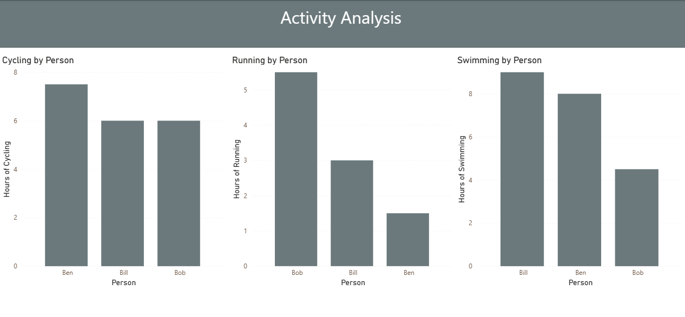

# Activity Data Analysis Dashboard

Power BI analysis of activity data for three individuals (Ben, Bob, Bill) across 4 weeks, demonstrating data transformation and standardization techniques.

## Project Goal

The primary objective was to standardize three different data structures (text, CSV, Excel) and merge them into a unified dataset suitable for comparative analysis across individuals and time periods.

## Repository Structure

```
cycling-data/
├── data/
│   ├── Ben figures.txt            # Text format weekly data
│   ├── Bob figures.csv            # CSV format activity data
│   └── Bill figures.xlsx          # Excel format weekly data
├── powerbi/
│   ├── activity-dashboard.pbix    # Power BI dashboard
│   └── activity-dashboard.pbit    # Power BI template
├── analysis/
│   └── transformation_log.md      # Detailed transformation steps
├── screenshots/                   # Dashboard previews
├── archive/
│   └── cycles.zip                 # Original data archive
└── README.md                      # This file
```

## Questions Answered

1. How do activity patterns compare across the three individuals?
2. What are the weekly trends for each activity type?
3. How do swimming, cycling, and running hours vary by person?

## How to Use

1. **Open dashboard**: Load `powerbi/activity-dashboard.pbix` in Power BI Desktop
2. **View transformations**: Read detailed steps in `analysis/transformation_log.md`
3. **Use template**: Apply `activity-dashboard.pbit` to similar datasets
4. **Explore data**: Use interactive filters to analyze by person and week

## Data Notes

- Raw data in 3 different formats: text, CSV, Excel
- Data transformation applied in Power Query: pivoting, standardization, appending
- Final dataset: 12 rows (4 weeks × 3 people) with unified schema

## Requirements

- Power BI Desktop

## Key Transformations

- **Ben figures**: Parsed text data and added Week identifiers
- **Bob figures**: Pivoted from long to wide format, standardized Week column  
- **Bill figures**: Added Person identifier column
- **Combined Data**: Appended all tables with consistent 5-column structure

## Dashboard Preview


